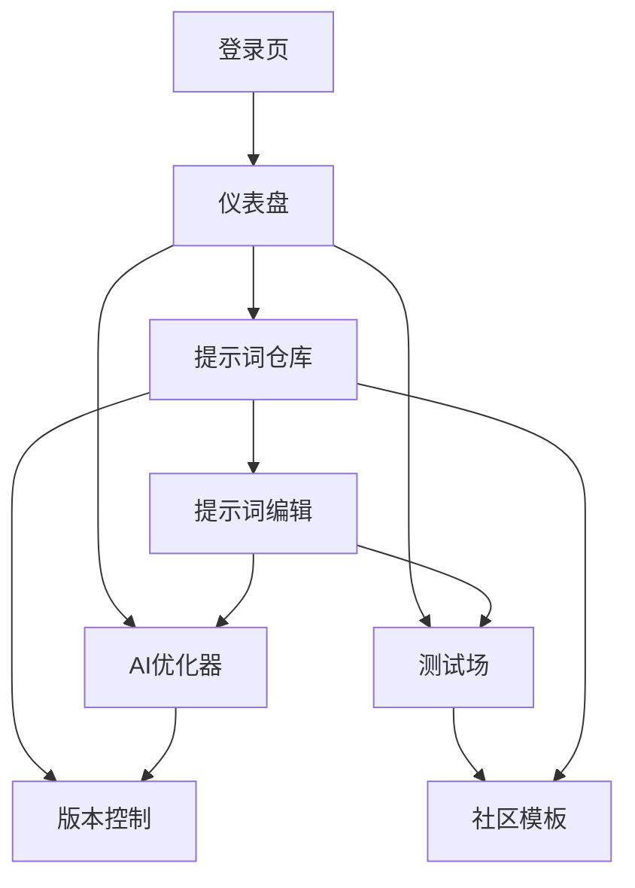

## 1. 产品概述
Prompt Genie是一个AI提示词优化和管理SaaS平台，帮助用户创建、优化、版本控制和测试AI提示词。专为AI开发者、内容创作者和企业用户设计，提升AI交互效率和输出质量。

## 2. 核心功能

### 2.1 用户角色
| 角色 | 注册方式 | 核心权限 |
|------|----------|----------|
| 免费用户 | 邮箱注册 | 创建20个提示词，基础AI优化，社区模板浏览 |
| 专业用户 | 订阅升级 | 无限制提示词，高级AI优化，版本控制，团队协作 |
| 企业用户 | 商务洽谈 | 私有部署，API接入，高级分析，专属支持 |

### 2.2 功能模块
Prompt Genie包含以下核心页面：
1. **仪表盘**：数据概览、快捷操作、最近活动
2. **提示词仓库**：创建、编辑、删除、搜索、标签管理
3. **版本控制**：历史记录、版本对比、回滚功能
4. **AI优化器**：智能优化建议、多模型对比、优化历史
5. **测试场**：实时测试、变量替换、批量测试、结果导出
6. **社区模板**：模板浏览、收藏、复用、分享

### 2.3 页面详情
| 页面名称 | 模块名称 | 功能描述 |
|----------|----------|----------|
| 仪表盘 | 数据概览 | 显示提示词总数、本周优化次数、测试场使用统计等关键指标 |
| 仪表盘 | 快捷操作 | 快速创建提示词、进入优化器、打开测试场的入口按钮 |
| 仪表盘 | 最近活动 | 展示最近编辑的提示词、优化记录、测试结果的时间线 |
| 提示词仓库 | 提示词列表 | 卡片式展示所有提示词，支持标题搜索、标签筛选、排序功能 |
| 提示词仓库 | 创建编辑 | 富文本编辑器，支持变量定义、语法高亮、模板语法检测 |
| 提示词仓库 | 标签管理 | 创建标签、批量打标签、标签云展示、热门标签推荐 |
| 版本控制 | 历史记录 | 时间轴形式展示所有版本变更，包含操作人、时间、变更说明 |
| 版本控制 | 版本对比 | 左右分栏对比不同版本差异，高亮显示新增、删除、修改内容 |
| 版本控制 | 版本回滚 | 一键恢复到任意历史版本，支持预览回滚后的效果 |
| AI优化器 | 智能分析 | 分析提示词语法、清晰度、具体性，给出结构化改进建议 |
| AI优化器 | 多模型对比 | 同时调用多个LLM模型生成优化建议，对比不同模型效果 |
| AI优化器 | 优化历史 | 保存所有优化记录，支持查看优化前后的对比和效果评分 |
| 测试场 | 实时测试 | 输入测试参数，实时查看AI模型输出结果，支持多轮对话 |
| 测试场 | 变量替换 | 动态替换提示词中的变量，支持批量生成不同场景的测试用例 |
| 测试场 | 结果导出 | 导出测试结果、性能指标、对比报告到PDF或Excel |
| 社区模板 | 模板市场 | 分类浏览社区共享的高质量提示词模板，支持评分和评论 |
| 社区模板 | 模板使用 | 一键复用模板到个人仓库，支持自定义修改和再次分享 |

## 3. 核心流程

### 3.1 用户主要操作流程
用户登录后首先进入仪表盘查看数据概览，可以快速创建新提示词或进入提示词仓库管理现有提示词。在提示词编辑页面，用户可以编写提示词内容、添加标签和变量。完成后可以选择保存并进入AI优化器获取改进建议，或直接进入测试场验证效果。优化后的提示词会自动生成新版本，用户可以随时查看版本历史并进行对比。满意的提示词可以发布到社区模板供其他用户使用。

### 3.2 页面导航流程

## 4. 用户界面设计

### 4.1 设计风格
- **主色调**：深蓝色(#1e40af)为主，白色背景，灰色(#6b7280)辅助文字
- **按钮样式**：圆角矩形，主要按钮使用主色调，次要按钮使用灰色边框
- **字体系统**：Inter字体家族，标题24-32px，正文14-16px，小字12px
- **布局风格**：左侧导航栏+右侧主内容区的经典SaaS布局，卡片式设计
- **图标风格**：使用Lucide React图标库，线性图标，保持视觉一致性

### 4.2 页面设计概览
| 页面名称 | 模块名称 | UI元素 |
|----------|----------|--------|
| 仪表盘 | 数据卡片 | 圆角卡片展示统计数据，使用渐变背景，数字使用大号粗体显示 |
| 提示词仓库 | 提示词卡片 | 白色卡片带阴影悬停效果，标题使用深蓝色，标签使用彩色小圆点 |
| 版本控制 | 时间轴 | 垂直时间轴设计，节点使用圆形图标，连接线使用虚线样式 |
| AI优化器 | 建议卡片 | 绿色边框卡片展示优化建议，使用图标区分不同类型的建议 |
| 测试场 | 分割面板 | 左右分割的可调整面板，左侧输入参数，右侧显示测试结果 |

### 4.3 响应式设计
采用桌面端优先的设计策略，确保在1920x1080分辨率下最佳显示效果。同时适配1366x768和1440x900等常见分辨率。移动端采用响应式布局，导航栏转换为汉堡菜单，卡片布局调整为单列显示，确保在小屏幕上的可用性。支持触摸操作优化，按钮和交互元素保持足够的点击区域。

### 4.4 交互设计
页面切换使用平滑过渡动画，加载状态显示骨架屏，操作反馈使用Toast提示。表单验证实时进行，错误状态使用红色边框和图标提示。成功操作使用绿色确认动画，重要操作需要二次确认。支持键盘快捷键操作，提升专业用户的使用效率。