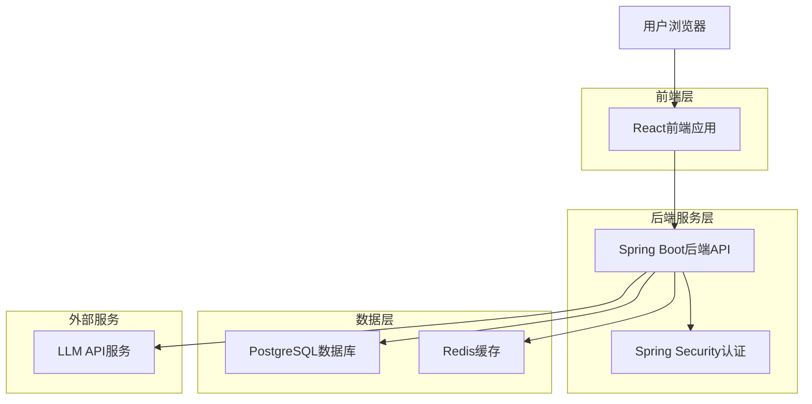
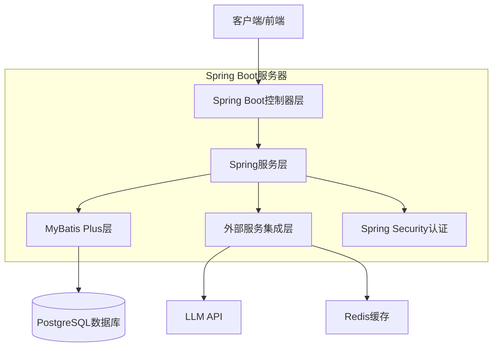
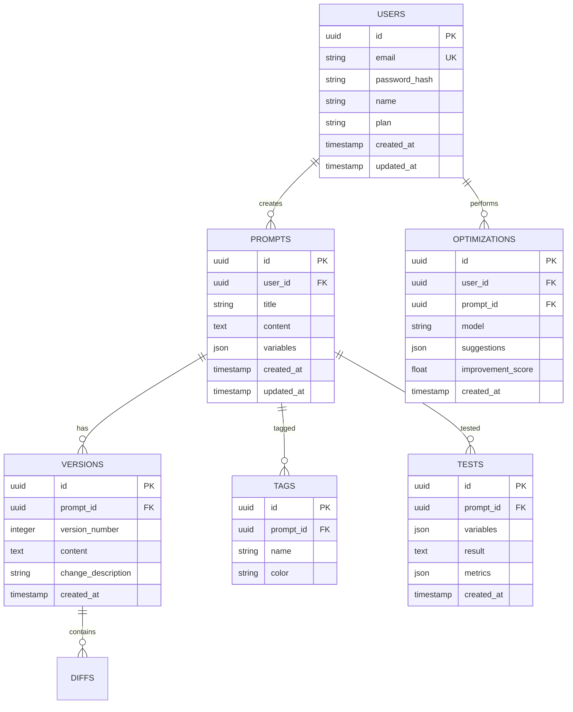

## 1. 架构设计



## 2. 技术描述

- **前端**: React@18 + TypeScript + TailwindCSS@3 + Vite
- **初始化工具**: vite-init
- **后端**: Spring Boot 3.x + Java 17+
- **构建工具**: Maven
- **ORM框架**: MyBatis Plus
- **数据库**: PostgreSQL (Supabase)
- **缓存**: Redis@7
- **认证**: Spring Security + JWT
- **状态管理**: Zustand
- **UI组件**: HeadlessUI + Radix UI
- **图表**: Recharts
- **富文本编辑器**: Monaco Editor
- **HTTP客户端**: Axios

## 3. 路由定义

| 路由 | 用途 |
|------|------|
| / | 登录页，用户认证入口 |
| /dashboard | 仪表盘，数据概览和快捷操作 |
| /prompts | 提示词仓库，管理所有提示词 |
| /prompts/new | 创建新提示词 |
| /prompts/:id | 编辑指定提示词 |
| /prompts/:id/versions | 查看提示词版本历史 |
| /optimizer | AI优化器，优化提示词 |
| /playground | 测试场，测试提示词效果 |
| /templates | 社区模板市场 |
| /profile | 用户个人设置 |

## 4. API定义

### 4.1 认证相关API

```
POST /api/auth/login
```

请求参数：
| 参数名 | 参数类型 | 是否必需 | 描述 |
|--------|----------|----------|------|
| email | string | 是 | 用户邮箱 |
| password | string | 是 | 用户密码 |

响应参数：
| 参数名 | 参数类型 | 描述 |
|--------|----------|------|
| access_token | string | JWT访问令牌 |
| refresh_token | string | 刷新令牌 |
| user | object | 用户信息 |

### 4.2 提示词管理API

```
GET /api/prompts
```

查询参数：
| 参数名 | 参数类型 | 是否必需 | 描述 |
|--------|----------|----------|------|
| page | number | 否 | 页码，默认1 |
| limit | number | 否 | 每页数量，默认20 |
| tag | string | 否 | 标签筛选 |
| search | string | 否 | 搜索关键词 |

```
POST /api/prompts
```

请求体：
| 参数名 | 参数类型 | 是否必需 | 描述 |
|--------|----------|----------|------|
| title | string | 是 | 提示词标题 |
| content | string | 是 | 提示词内容 |
| tags | array | 否 | 标签数组 |
| variables | object | 否 | 变量定义 |

### 4.3 AI优化API

```
POST /api/optimize
```

请求体：
| 参数名 | 参数类型 | 是否必需 | 描述 |
|--------|----------|----------|------|
| prompt_id | string | 是 | 提示词ID |
| model | string | 否 | AI模型，默认gpt-4 |
| optimization_type | string | 否 | 优化类型：clarity, specificity, structure |

### 4.4 测试场API

```
POST /api/playground/test
```

请求体：
| 参数名 | 参数类型 | 是否必需 | 描述 |
|--------|----------|----------|------|
| prompt_content | string | 是 | 提示词内容 |
| test_variables | object | 否 | 测试变量 |
| model | string | 否 | 测试模型 |
| test_count | number | 否 | 测试次数，默认1 |

## 5. 服务器架构图



## 6. 数据模型

### 6.1 数据模型定义



### 6.2 数据定义语言

用户表 (users)
```sql
-- 创建表
CREATE TABLE users (
    id UUID PRIMARY KEY DEFAULT gen_random_uuid(),
    email VARCHAR(255) UNIQUE NOT NULL,
    password_hash VARCHAR(255) NOT NULL,
    name VARCHAR(100) NOT NULL,
    plan VARCHAR(20) DEFAULT 'free' CHECK (plan IN ('free', 'pro', 'enterprise')),
    created_at TIMESTAMP WITH TIME ZONE DEFAULT NOW(),
    updated_at TIMESTAMP WITH TIME ZONE DEFAULT NOW()
);

-- 创建索引
CREATE INDEX idx_users_email ON users(email);
CREATE INDEX idx_users_plan ON users(plan);
```

提示词表 (prompts)
```sql
-- 创建表
CREATE TABLE prompts (
    id UUID PRIMARY KEY DEFAULT gen_random_uuid(),
    user_id UUID REFERENCES users(id) ON DELETE CASCADE,
    title VARCHAR(255) NOT NULL,
    content TEXT NOT NULL,
    variables JSONB DEFAULT '{}',
    created_at TIMESTAMP WITH TIME ZONE DEFAULT NOW(),
    updated_at TIMESTAMP WITH TIME ZONE DEFAULT NOW()
);

-- 创建索引
CREATE INDEX idx_prompts_user_id ON prompts(user_id);
CREATE INDEX idx_prompts_created_at ON prompts(created_at DESC);
CREATE INDEX idx_prompts_title ON prompts(title);
```

版本表 (versions)
```sql
-- 创建表
CREATE TABLE versions (
    id UUID PRIMARY KEY DEFAULT gen_random_uuid(),
    prompt_id UUID REFERENCES prompts(id) ON DELETE CASCADE,
    version_number INTEGER NOT NULL,
    content TEXT NOT NULL,
    change_description VARCHAR(500),
    created_at TIMESTAMP WITH TIME ZONE DEFAULT NOW()
);

-- 创建索引
CREATE INDEX idx_versions_prompt_id ON versions(prompt_id);
CREATE INDEX idx_versions_version_number ON versions(prompt_id, version_number);
```

优化记录表 (optimizations)
```sql
-- 创建表
CREATE TABLE optimizations (
    id UUID PRIMARY KEY DEFAULT gen_random_uuid(),
    user_id UUID REFERENCES users(id) ON DELETE CASCADE,
    prompt_id UUID REFERENCES prompts(id) ON DELETE CASCADE,
    model VARCHAR(50) NOT NULL,
    suggestions JSONB NOT NULL,
    improvement_score DECIMAL(3,2),
    created_at TIMESTAMP WITH TIME ZONE DEFAULT NOW()
);

-- 创建索引
CREATE INDEX idx_optimizations_user_id ON optimizations(user_id);
CREATE INDEX idx_optimizations_prompt_id ON optimizations(prompt_id);
CREATE INDEX idx_optimizations_created_at ON optimizations(created_at DESC);
```

### 6.3 Spring Boot实体类示例

```java
// User实体
@TableName("users")
public class User {
    @TableId(type = IdType.ASSIGN_UUID)
    private UUID id;
    
    private String email;
    
    @TableField("password_hash")
    private String passwordHash;
    
    private String name;
    
    private String plan = "free";
    
    @TableField(fill = FieldFill.INSERT)
    private LocalDateTime createdAt;
    
    @TableField(fill = FieldFill.INSERT_UPDATE)
    private LocalDateTime updatedAt;
    
    // getters, setters, constructors
}

// Prompt实体
@TableName("prompts")
public class Prompt {
    @TableId(type = IdType.ASSIGN_UUID)
    private UUID id;
    
    @TableField("user_id")
    private UUID userId;
    
    private String title;
    
    private String content;
    
    private Map<String, Object> variables = new HashMap<>();
    
    @TableField(fill = FieldFill.INSERT)
    private LocalDateTime createdAt;
    
    @TableField(fill = FieldFill.INSERT_UPDATE)
    private LocalDateTime updatedAt;
    
    // getters, setters, constructors
}
```

### 6.4 Spring Boot Mapper示例

```java
@Mapper
public interface PromptMapper extends BaseMapper<Prompt> {
    
    @Select("SELECT * FROM prompts WHERE user_id = #{userId} ORDER BY created_at DESC")
    List<Prompt> selectByUserIdOrderByCreatedAtDesc(@Param("userId") UUID userId);
    
    @Select("<script>" +
            "SELECT p.* FROM prompts p " +
            "WHERE p.user_id = #{userId} " +
            "<if test='search != null'>" +
            "AND LOWER(p.title) LIKE LOWER(CONCAT('%', #{search}, '%')) " +
            "</if>" +
            "<if test='tag != null'>" +
            "AND EXISTS (SELECT 1 FROM tags t WHERE t.prompt_id = p.id AND t.name = #{tag}) " +
            "</if>" +
            "ORDER BY p.created_at DESC" +
            "</script>")
    List<Prompt> selectByUserIdAndFilters(@Param("userId") UUID userId,
                                          @Param("search") String search,
                                          @Param("tag") String tag);
}

@Mapper
public interface UserMapper extends BaseMapper<User> {
    
    @Select("SELECT * FROM users WHERE email = #{email}")
    User selectByEmail(@Param("email") String email);
    
    @Select("SELECT COUNT(*) > 0 FROM users WHERE email = #{email}")
    boolean existsByEmail(@Param("email") String email);
}
```